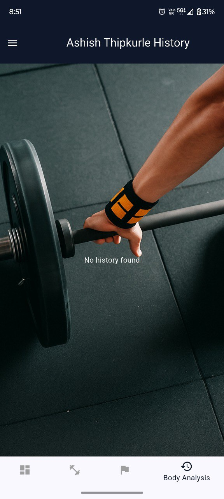

# ApexBody

ApexBody is a modern, cross-platform gym and fitness management application built with Flutter. It empowers trainers, clients, and gym admins to manage workouts, track progress, set weekly goals, and synchronize data across devices. The app supports Android, iOS, and Web, with features including:

- **Workout Logging:** Add, edit, and preview strength and cardio workouts with dynamic calorie calculations.
- **Weekly Goals:** Set, edit, and visualize personalized exercise targets for each client.
- **Admin Panel:** Manage users, export workout history, and oversee gym operations.
- **PWA Support:** Installable web app with custom branding and offline capabilities.
- **Data Sync:** Supabase backend for secure, real-time data synchronization; Hive for local storage.
- **Modern UI:** Glassmorphism cards, animated lists, and responsive layouts for a premium user experience.

ApexBody is designed for gyms, trainers, and fitness enthusiasts seeking a robust, scalable solution for workout and client management.

---

## Getting Started

1. **Clone the repository:**
   ```sh
   git clone https://github.com/ashishthipkurle/ApexBody.git
   ```
2. **Install dependencies:**
   ```sh
   flutter pub get
   ```
3. **Run the app:**
   - Android/iOS: `flutter run`
   - Web: `flutter run -d chrome`

## License
MIT

## Screenshots

Below are sample screens from ApexBody (see more in `assets/Screenshots/`):

### Login & Signup
<div style="display: flex; gap: 12px;">
  
  
</div>

### Starting Page


### Admin Panel
<div style="display: flex; gap: 12px; flex-wrap: wrap;">
  
  
  
</div>
<div style="display: flex; gap: 12px; flex-wrap: wrap;">
  
  
</div>
<div style="display: flex; gap: 12px; flex-wrap: wrap;">
  
  
</div>

### Client Panel
<div style="display: flex; gap: 12px; flex-wrap: wrap;">
  
  
</div>
<div style="display: flex; gap: 12px; flex-wrap: wrap;">
  
  
</div>
<div style="display: flex; gap: 12px; flex-wrap: wrap;">
  
</div>

---
